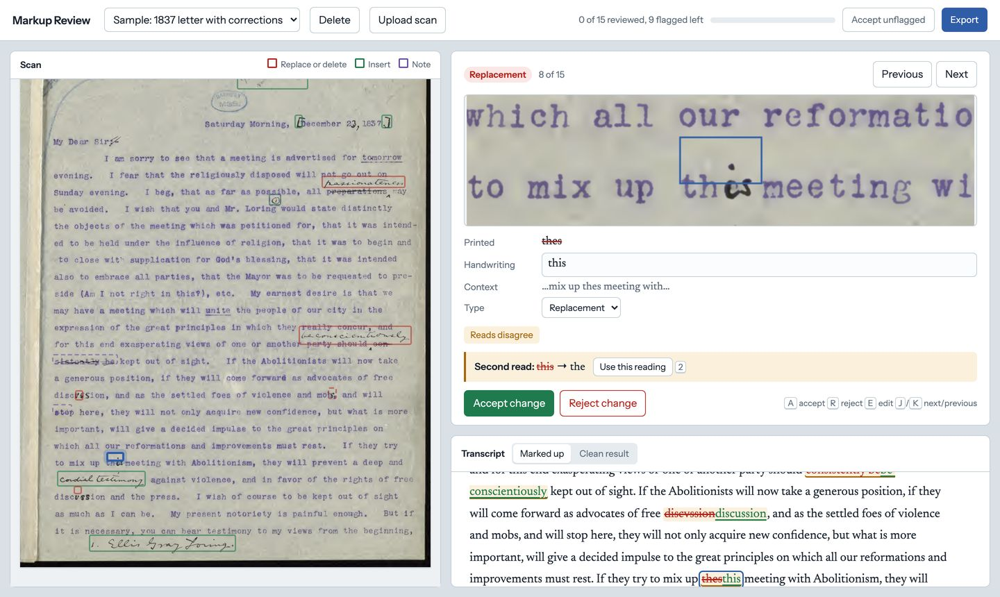

# Markup Review

Review handwritten edits on scanned documents. Markup Review sends each page to the [Unsiloed](https://www.unsiloed.ai) `/v2/extract` endpoint twice, turns the result into a list of tracked changes, with a bounding box for each detected change that has a location, and flags the changes a person should check. A reviewer accepts or rejects each change against a close-up of the scan, then exports the clean text and a log of every decision.



The [Review Handwritten Edits cookbook](https://docs.unsiloed.ai/cookbooks/review-handwritten-edits) explains how the app works.

## Run It Locally

You need Python 3.13 or higher and an [Unsiloed API key](https://www.unsiloed.ai).

```bash
git clone https://github.com/Unsiloed-AI/cookbook.git
cd cookbook/handwritten-review

python3 -m venv .venv
source .venv/bin/activate
pip install -r requirements.txt

cp .env.example .env   # then add your UNSILOED_API_KEY

uvicorn app:app --reload
```

Open http://localhost:8000. The app opens a sample letter from 1837 with its two reads already saved, so you can try the review screen before making any API calls. Select **Upload scan** to process your own PDF or image. Each page costs two `/v2/extract` calls, one per read.

## Review a Document

The scan shows a box over each detected change that has a location: red for a replacement or deletion, green for an insertion, purple for a note, and dashed for a mark only the second read found.

To review a document:

1. Select **Accept unflagged** to accept every change with no flags.
2. Work through the flagged changes. Compare the close-up with the handwriting, correct the text or the change type if needed, and accept or reject it.
3. For a mark only the second read found (dashed box), check it on the scan and select **Mark as checked**. These marks aren't in the transcript, so they aren't applied. Correct the exported text by hand if one is a real edit. The log records it as checked, not applied.
4. Switch the transcript to **Clean result** and read it against the scan once. The review lists detected changes only, so this catches any mark neither read found.
5. Select **Export** to download the clean text and a JSON log of every decision.

| Key | Action |
|---|---|
| <kbd>J</kbd> / <kbd>K</kbd> | Next or previous change |
| <kbd>A</kbd> / <kbd>R</kbd> | Accept or reject |
| <kbd>E</kbd> | Edit the handwriting |
| <kbd>2</kbd> | Use the second read's version |
| <kbd>U</kbd> | Undo the decision |

Changes you haven't reviewed keep the printed text in the export.

## Configuration

The app needs one setting, `UNSILOED_API_KEY`, in `.env` or the environment. The model (`gamma`) is set in `review/extract.py`, and the confidence threshold for flagging (0.5) in `review/redline.py`.

## Project Layout

```
handwritten-review/
├── app.py              # FastAPI server: upload, review items, decisions, export
├── frontend/index.html # The review page (no build step)
├── review/
│   ├── prepare.py      # Render scans at full resolution and package them as a PDF
│   ├── schema.json     # The redline extraction schema
│   ├── extract.py      # Submit to /v2/extract and poll, twice in parallel
│   ├── redline.py      # Parse the redline, attach boxes, compare reads, apply decisions
│   └── pipeline.py     # Run the steps above for one file, a page at a time
├── sample/             # The sample letter and its saved reads
└── tests/
```

Each processed document is stored in `documents/<id>/` with its page images, raw reads, review, and decisions.

To run the tests, install the test dependencies, then run the backend tests and the review page's saving and navigation tests (which need Node.js 18 or higher):

```bash
pip install -r requirements-dev.txt
pytest
node --test tests/review-page.test.mjs
```

The sample letter is a public-domain 1837 letter from William Ellery Channing to William Lloyd Garrison, from the [Internet Archive](https://archive.org/details/lettertomydearsi00hill).
